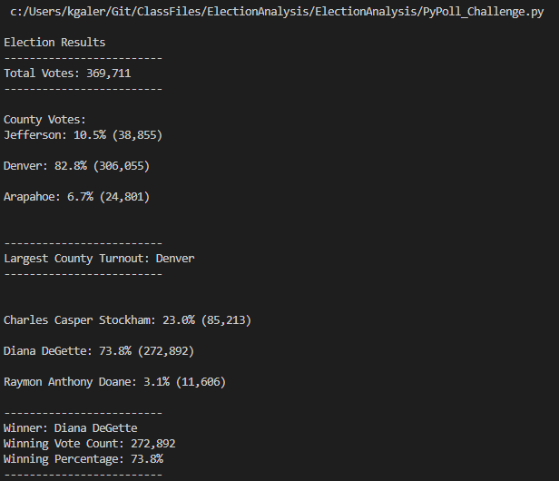

# ElectionAnalysis
## Overview
The purpose of this analysis is to use Python to create a code that opens and analyzes information in a csv file. In this case, election data. The analysis includes a tally of all votes, votes per candidate, and votes per county, as well as vote percentages and the winning candidate. It outputs the data in the terminal window as well as storing it in a text file.

## Election-Audit Results:
Using the code located here: [PyPoll_Challenge](PyPoll_Challenge.py) . The following information was determined:
* Total Votes: 369,711
* Votes by County: 
    - Jefferson: 10.5% (38,855)
    - Denver: 82.8% (306,055)
    - Arapahoe: 6.7% (24,801)
* Denver had the largest number of votes
* Votes by Candidate:
    - Charles Casper Stockham: 23.0% (85,213)
    - Diana DeGette: 73.8% (272,892)
    - Raymon Anthony Doane: 3.1% (11,606)
* Winner: 
    - Winner: Diana DeGette
    - Winning Vote Count: 272,892
    - Winning Percentage: 73.8%

This information was output in the election_analysis text file located here: [election_analysis](analysis/election_analysis.txt)

This is an image of the output from the terminal: 

## Election-Audit Summary:
This code would work for election files so long as the data is collected in a csv file titled "election_results" located in a resources folder; the candidate name must be located in the third column, and the county in the second column. It should easily work regardless the number of candidates or counties. However, there are updates that could be made to allow it to be used for different election files. These include:

1. Making the election file name and/or folder location a user input. If the user wanted to store data in different folders, or name their data files with more details, this would allow them to input the names directly.
2. Allowing the user to title the ouput file. An input command could be used, so the user could enter a title with a specific or detailed name.
3. Using an if statement to compare the header of each column to ensure the information expected (e.g. county or candidate) is actually in the column selected. 

